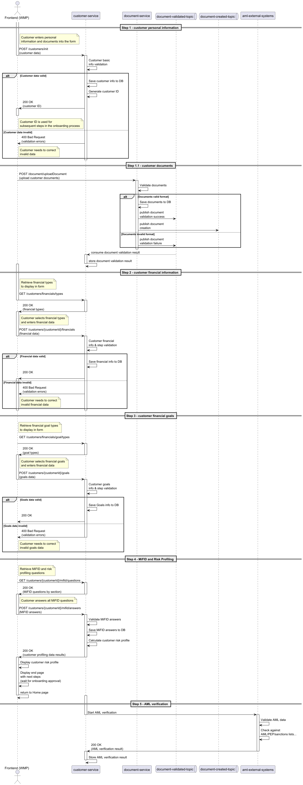

# Customer Onboarding Process

This document describes the complete customer onboarding process for the Wealth Management Platform (WMP), detailing all steps, actors, and components involved. The process is designed to ensure a secure, compliant, and user-friendly experience for both the end user and the back-office operators.

---

## Actors and Components

- **Frontend (WMP):** The user interface where the customer or operator interacts with the onboarding workflow.
- **customer-service:** The backend service responsible for managing customer data, validation, and orchestration of the onboarding process.
- **document-service:** Handles document storage, validation, and management.
- **aml-external-systems:** External systems for Anti-Money Laundering (AML) checks and compliance.
- **email-service:** Sends notifications and onboarding status updates to customers.
- **Kafka Topics:** Used for asynchronous communication between services (e.g., `create-document-topic`, `document-validated-topic`, `customer-created-topic`, `customer-rejected-topic`).

---

## Step-by-Step Process

### 1. Customer Personal Information
- The customer starts the onboarding process via the Frontend (WMP).
- The customer enters personal information and uploads required documents.
- The Frontend sends a `POST /customers/init` request to `customer-service` with the provided data.
- `customer-service` validates the basic information:
    - If valid, it saves the data, generates a customer ID, and publishes a message to `create-document-topic` for document creation.
    - The service responds to the Frontend with `200 OK` and the customer ID.
    - If invalid, it responds with `400 Bad Request` and validation errors.
- `document-service` consumes the document creation request, validates the documents:
    - If valid, saves them and publishes a success message to `document-validated-topic`.
    - If invalid, publishes a failure message to the same topic.
- `customer-service` consumes the document validation result and stores it.

### 2. Customer Financial Information
- The Frontend retrieves available financial types via `GET /customers/financials/types`.
- The customer selects financial types and submits financial data via `POST /customers/{customerId}/financials`.
- `customer-service` validates and stores the financial information:
    - If valid, responds with `200 OK`.
    - If invalid, responds with `400 Bad Request` and validation errors.

### 3. Customer Financial Goals
- The Frontend retrieves available goal types via `GET /customers/financials/goal/types`.
- The customer selects goals and submits them via `POST /customers/{customerId}/goals`.
- `customer-service` validates and stores the goals:
    - If valid, responds with `200 OK`.
    - If invalid, responds with `400 Bad Request` and validation errors.

### 4. MiFID and Risk Profiling
- The Frontend retrieves MiFID and risk profiling questions via `GET /customers/{customerId}/mifid/questions`.
- The customer answers the questions and submits them via `POST /customers/{customerId}/mifid/answers`.
- `customer-service` validates and stores the answers, calculates the risk profile, and responds with the profiling results.
- The Frontend displays the risk profile and the end page, indicating the next steps (waiting for onboarding approval).

### 5. AML Verification
- `customer-service` initiates AML verification by communicating with `aml-external-systems`.
- The external systems validate the data, check against AML/PEP/sanctions lists, and return the result.
- `customer-service` stores the AML verification result.

---

## Onboarding Evaluation (Final Step)
- If the onboarding is approved:
    - `customer-service` stores the approval reason and status.
    - Publishes a message to `customer-created-topic` with customer ID and user data.
    - `email-service` consumes the event and sends a customer onboarding email.
- If the onboarding is rejected:
    - `customer-service` stores the rejection reason and status.
    - Publishes a message to `customer-rejected-topic` with customer ID and reason.
    - `email-service` consumes the event and sends a rejection email.

---

## Onboarding Status Check (On-Demand)
- The customer can check the onboarding status at any time via `GET /customers/{customerId}/onboarding/status`.
- `customer-service` retrieves and returns the current onboarding status, which can be:
    - In progress
    - Approved
    - Rejected
- The Frontend displays the status and, based on the result, may show additional messages or redirect the user.

---

## Sequence Diagrams

### Main Onboarding Process

### Onboarding Evaluation

### Onboarding Status Check

---

This process ensures a robust, modular, and event-driven onboarding workflow, leveraging microservices and asynchronous communication for scalability and maintainability.

